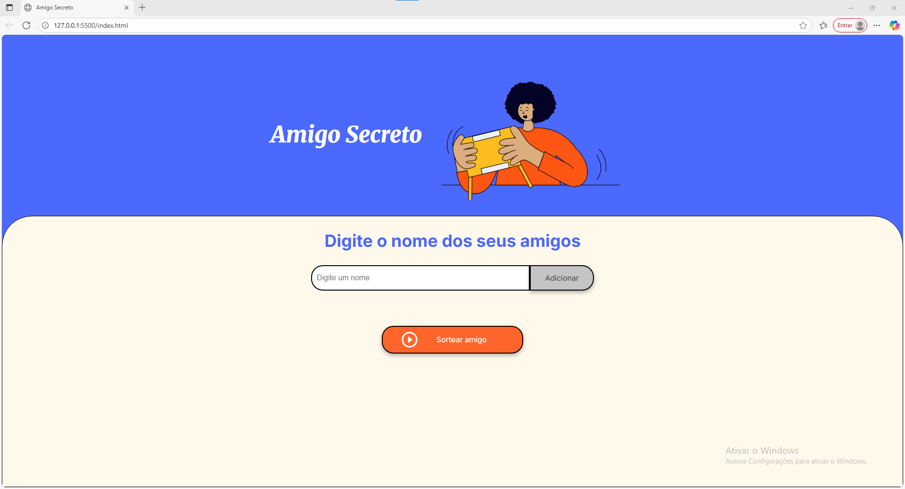

# Projeto Amigo Secreto 🎁

Este projeto é um **sistema de Amigo Secreto** desenvolvido para praticar lógica de programação em JavaScript. O HTML e CSS já estão prontos, permitindo que você se concentre exclusivamente na implementação da lógica, utilizando **funções, arrays, condicionais e variáveis**.

---

## Funcionalidades

- Adicionar nomes dos participantes.
- Listar participantes adicionados.
- Realizar o sorteio de forma aleatória, garantindo que ninguém tire o próprio nome.
- Exibir o resultado do sorteio de forma clara e organizada.

---

## Tecnologias Utilizadas

- **HTML** – Estrutura da página.
- **CSS** – Estilo visual.
- **JavaScript** – Lógica do sorteio e manipulação de dados.

---

## Como Usar

1. **Abrir o projeto:**  
   Abra o arquivo `index.html` no navegador.

2. **Adicionar participantes:**  
   Digite os nomes no campo correspondente e clique em “Adicionar”.

3. **Realizar o sorteio:**  
   Clique no botão “Sortear” e veja o resultado do amigo secreto de cada participante.

---

## Capturas de Tela

  

*Exemplo de resultado do sorteio.*

  

*Exemplo de tela para adicionar participantes.*

---

## Observações

- Certifique-se de que todos os nomes sejam únicos.
- Evite sortear com apenas um participante, pois não é possível realizar o sorteio.

---

## Desafio de Aprendizado

Este projeto foi desenvolvido com foco em **raciocínio lógico**, reforçando conceitos como:

- Manipulação de arrays.
- Uso de funções para modularizar o código.
- Estruturas condicionais para validar entradas e evitar erros no sorteio.
